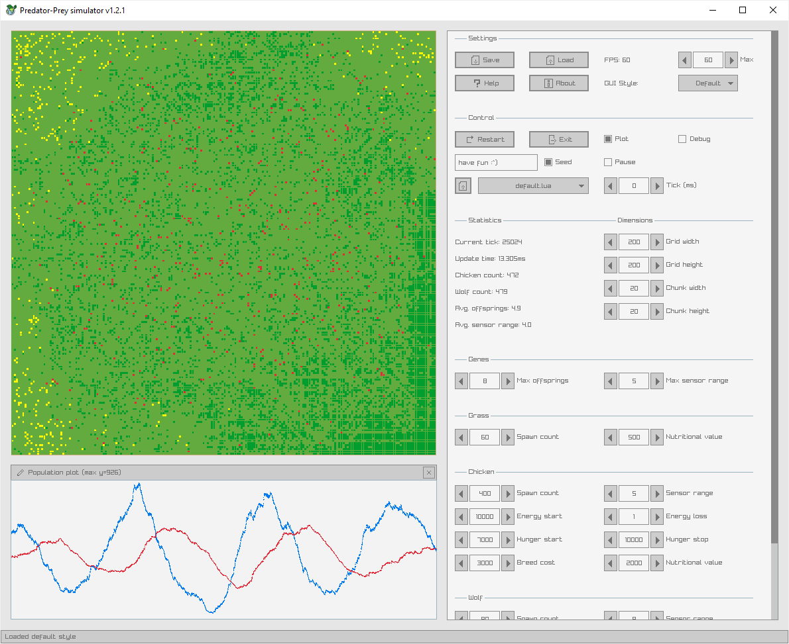
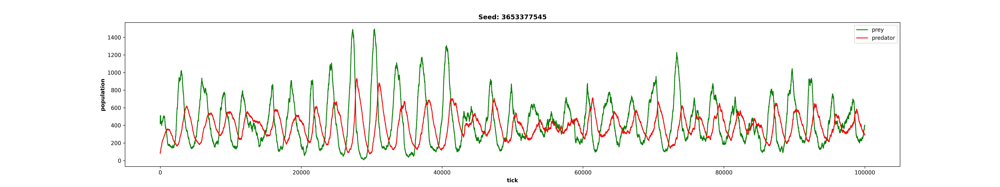

<h1 align="center">Predator-Prey simulator</h1>

<p align="center">
    
</p>

<p align="center">
    Predator-Prey simulator written in C++.
</p>

## Screenshot



## Plot created with `run_and_plot.py`



# Building 

Required programs:

- C++ compiler
- cmake

## Downloading submodules

```bash
git submodule update --init --recursive
```

## Installing Ubuntu dependencies

```bash
sudo apt install \
    build-essential git cmake libasound2-dev mesa-common-dev libx11-dev \
    libxrandr-dev libxi-dev xorg-dev libgl1-mesa-dev libglu1-mesa-dev libluajit-5.1-dev
```

## Running CMake
```bash
mkdir build && cd build
cmake -DCMAKE_BUILD_TYPE=Release ..
cmake --build .
```

# Running Predator-Prey simulator
```bash
./sim # Launch graphical interface

./sim 1000 # Run simulation 1000 times and output CSV statistics to stdout

# Helper script to create 10 plots of 1000 tick simulations and launch them as 4 parallel processes
python run_and_plot.py sim.exe 1000 default.lua 10 4
```

# Attributions

Textures by [Franuka](https://franuka.itch.io/).

Icon made by [Freepik](https://www.freepik.com/) from [Flaticon](https://www.flaticon.com/).
